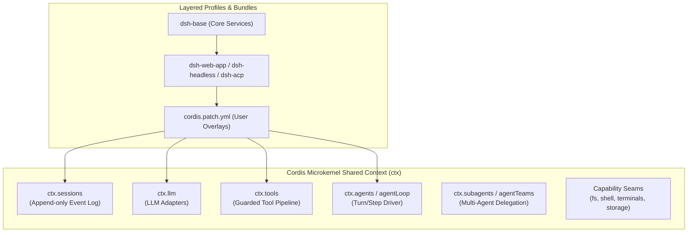
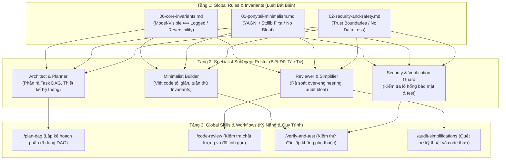

# Nghiên Cứu Chi Tiết Kiến Trúc DeepSeek Harness (`dsh`) & Kế Hoạch Xây Dựng Hệ Thống Global Agent Hoàn Chỉnh

> **Ngày lập báo cáo:** 03/09/2026  
> **Mục tiêu:** Phân tích toàn diện kiến trúc tác tử mã nguồn mở **DeepSeek Harness** từ DeepSeek AI, giải mã các trụ cột thiết kế (Cordis framework, Capability Seams, Event Log Invariant, Subagent Teams), và xây dựng kế hoạch hành động chi tiết để thiết lập hệ thống **Global Agent** tối ưu cho môi trường làm việc cá nhân.

---

## MỤC LỤC

1. [Tổng Quan Về DeepSeek Harness (`dsh`)](#1-tổng-quan-về-deepseek-harness-dsh)
2. [Giải Mã Chi Tiết Kiến Trúc Kỹ Thuật (Architectural Deep Dive)](#2-giải-mã-chi-tiết-kiến-trúc-kỹ-thuật)
   - 2.1. Triết Lý Cốt Lõi: *Everything-Is-A-Plugin* & Nền Tảng Cordis
   - 2.2. Cơ Chế Phân Tầng Cấu Hình: Profiles & Bundles
   - 2.3. Nguyên Lý Bất Biến Của Dữ Liệu: *"Model-Visible ⟺ Logged"*
   - 2.4. Hệ Thống Khớp Nối Năng Lực (Capability Seams System)
   - 2.5. Vòng Đời Lượt Làm Việc & Bước Thực Thi (Turn & Step Lifecycle)
   - 2.6. Pipeline Điều Phối & Thực Thi Công Cụ (Guarded Tool Pipeline)
   - 2.7. Cơ Chế Đa Tác Tử & Nhóm Tác Tử Bền Vững (Subagents & Agent Teams)
3. [Đánh Giá, So Sánh & Bài Học Áp Dụng Cho Môi Trường Antigravity / Gemini CLI](#3-đánh-giá-so-sánh--bài-học-áp-dụng)
4. [Kế Hoạch Thiết Lập Hệ Thống Global Agent Hoàn Chỉnh](#4-kế-hoạch-thiết-lập-hệ-thống-global-agent-hoàn-chỉnh)
   - 4.1. Kiến Trúc Phân Lớp Global Agent Đề Xuất
   - 4.2. Danh Mục Các Specialist Subagents (Roster)
   - 4.3. Danh Mục Các Global Rules & Invariants (Luật Bất Biến)
   - 4.4. Danh Mục Các Skills Thực Thi Độc Lập
   - 4.5. Lộ Trình Triển Khai Chi Tiết (Implementation Roadmap)

---

## 1. TỔNG QUAN VỀ DEEPSEEK HARNESS (`dsh`)

**DeepSeek Harness** (`dsh`) là bộ khung điều phối tác tử (Agent Harness) mã nguồn mở thế hệ mới do **DeepSeek AI** nghiên cứu và phát triển. Khác biệt với các nền tảng tác tử nguyên khối (monolithic agents) như AutoGPT sơ khai hay các framework nặng về abstraction tĩnh (như LangChain), DeepSeek Harness được thiết kế để giải quyết bài toán: **Làm sao để một coding agent có thể vận hành ổn định trong các dự án phần mềm khổng lồ, hỗ trợ khả năng mở rộng không giới hạn, không có "nhân đặc quyền" (no privileged core), và mọi hành vi đều có thể tái hiện/suy xét độc lập (deterministic reproducibility).**

### Các đặc điểm nổi bật
* **Hệ sinh thái Monorepo đa ngôn ngữ**: Quản lý hơn 50+ packages chuyên biệt dưới cấu trúc `@deepseek-ai/dsh-*` (TypeScript/Node.js), kết hợp với runtime native (Rust/C++ qua Node Addons) và Python SDK.
* **Được bảo chứng bằng lý thuyết**: Xây dựng trên nền tảng **Cordis Framework**, dựa trên công trình nghiên cứu *"A Programming Paradigm for Spatiotemporal Composability"* (arXiv:2608.25512).
* **Đa bề mặt thực thi (Multi-surface Launchers)**: Cùng một lõi logic nhưng có thể khởi chạy dưới dạng Web UI (`dsh web`), Headless CLI (`dsh --profile headless`), Agent Client Protocol (`dsh --profile acp`), hoặc JSON-RPC Daemon cho SDK (`dsh --profile sdk`).

---

## 2. GIẢI MÃ CHI TIẾT KIẾN TRÚC KỸ THUẬT



### 2.1. Triết Lý Cốt Lõi: *Everything-Is-A-Plugin* & Nền Tảng Cordis

Điểm đột phá lớn nhất của DeepSeek Harness là **xoá bỏ hoàn toàn khái niệm "Core nguyên khối"**. 
* Trong hầu hết các hệ thống AI agent truyền thống, vòng lặp agent (agent loop) và bộ công cụ được gắn cứng vào nhân của ứng dụng. Muốn thay đổi logic prompt hay cơ chế bắt lỗi, nhà phát triển buộc phải fork hoặc patch vào core code.
* Trong Harness, **mọi thứ đều là một Plugin** được gắn vào một `Context` dùng chung (`ctx`). Bản thân `ctx.llm` (bộ chuyển đổi mô hình), `ctx.tools` (bộ quản lý công cụ), `ctx.sessions` (nhật ký phiên), và thậm chí cả `ctx.agentLoop` (vòng lặp điều khiển agent) đều là các plugin ngang hàng.
* **Cơ chế Reversible Effects (Tác động khả nghịch)**: Mọi sự đăng ký của plugin (`ctx.effect()`, `ctx.on()`, `ctx.tools.register()`) đều trả về một disposer function. Khi một plugin bị unload hoặc disable trong thời gian chạy (runtime), toàn bộ các sự kiện, công cụ, và hooks mà nó đưa vào hệ thống sẽ được tự động thu hồi sạch sẽ (unwind), ngăn chặn triệt để hiện tượng rò rỉ bộ nhớ hoặc hiệu ứng phụ ngoài ý muốn.

### 2.2. Cơ Chế Phân Tầng Cấu Hình: Profiles & Bundles

Để quản lý việc lắp ghép hàng chục plugin mà không gây hỗn loạn, Harness phân tách rõ rệt:
1. **Bundle**: Một gói phân phối chứa các dòng cấu hình Cordis và mã nguồn thực thi tương ứng (ví dụ: `dsh-base` chứa các adapter căn bản, policy sandbox, và toolset chuẩn; `dsh-web-app` bổ sung giao diện đồ hoạ web; `dsh-acp-app` bổ sung giao thức tự động hóa).
2. **Profile**: Một bản đặc tả kết hợp (composition) gồm các bundle được xếp chồng lên nhau theo thứ tự ưu tiên nghiêm ngặt:
   $$\text{Entry List} = \text{Bundles (theo thứ tự)} \to \text{Profile Patch} \to \text{Home-level Patch} \to \text{CLI Flag Overlays}$$
3. Nhờ cơ chế patch này, người dùng có thể thay thế bất kỳ service nào (ví dụ thay adapter mô hình mặc định bằng một endpoint riêng) bằng cách khai báo một file YAML `cordis.patch.yml` mà không chạm vào một dòng mã nguồn nào của hệ thống.

### 2.3. Nguyên Lý Bất Biến Của Dữ Liệu: *"Model-Visible ⟺ Logged"*

Harness áp dụng nguyên tắc thiết kế bất khả xâm phạm: **Bất kỳ thông tin nào mà mô hình LLM nhìn thấy trong ngữ cảnh (context window) đều BẮT BUỘC phải có khả năng tái tạo lại 100% từ Session Event Log.**

* **Cấu trúc Log dạng Append-Only**: Nhật ký phiên không lưu các chuỗi chat thông thường mà lưu trữ một luồng các sự kiện bền vững (Durable Session Events):
  * `turn/start`, `turn/end`: Xác định ranh giới phiên tương tác người dùng.
  * `step/start`, `step/end`: Xác định một bước xử lý cụ thể của agent.
  * `user/message`: Tin nhắn người dùng hoặc tin nhắn ủy quyền.
  * `assistant/chunk`: Các luồng token được truyền phát thời gian thực từ LLM.
  * `assistant/message`: Bản ghi tổng hợp kết quả của mô hình sau khi kết thúc stream.
  * `tool/call`: Tên công cụ và toàn bộ đối số (arguments) dưới dạng JSON đóng băng (frozen immutable JSON).
  * `tool/result`: Kết quả đầu ra chuẩn mực (canonical lossless output) của công cụ.
* **Phép chiếu trạng thái (Session Projection)**: Mọi tính năng cao cấp như tạo tóm tắt (compaction), gắn nhãn phiên (session title), phân nhánh phiên (session forking), quay ngược thời gian (time-travel debugging), và vẽ lại giao diện đều là các phép chiếu tính toán thuần túy (`stateOf()`, `snapshot()`) từ luồng log sự kiện này. Nếu một dữ liệu không thể tìm thấy trong log, nó không được phép đưa vào ngữ cảnh của mô hình.

### 2.4. Hệ Thống Khớp Nối Năng Lực (Capability Seams System)

Một điểm sáng chói trong thiết kế kiến trúc phần mềm của DeepSeek Harness là mô hình **Capability Seams**. Một "Seam" (đường may/khớp nối) là một năng lực có thể tráo đổi hoàn toàn, luôn bao gồm đủ 3 vai trò:
1. **Service Definition (Định nghĩa Dịch vụ)**: Interface trừu tượng khai báo năng lực (ví dụ: `ctx.fs`, `ctx.shell`, `ctx.tools`, `ctx.subagents`).
2. **Service Provider (Nhà cung cấp Dịch vụ)**: Hiện thực hoá cụ thể của interface đó (ví dụ: Provider `fs-local` đọc ghi ổ cứng trực tiếp; Provider `e2b-sandbox` đọc ghi trên một Docker container trên đám mây; Provider `llm-deepseek` kết nối API DeepSeek-V3/R1).
3. **Consumer (Đối tượng tiêu thụ)**: Các công cụ model-facing hoặc các tiến trình nghiệp vụ gọi dịch vụ thông qua interface.

**Lợi ích đột phá**: Khi chuyển đổi môi trường từ chạy local sang chạy trong Sandbox an toàn (như E2B), chỉ cần đổi Service Provider từ `local` sang `e2b`. Toàn bộ các công cụ `bash`, `read_file`, `write_file`, `terminal` tự động chuyển hướng vào sandbox mà không phải viết lại bất kỳ một công cụ nào!

### 2.5. Vòng Đời Lượt Làm Việc & Bước Thực Thi (Turn & Step Lifecycle)

Harness định nghĩa ranh giới xử lý cực kỳ chặt chẽ giữa **Turn (Lượt)** và **Step (Bước)**:
* **Turn (Lượt)**: Mở ra ngay khi có tin nhắn đầu vào từ người dùng được trích xuất từ Inbox, và chỉ đóng lại khi agent hoàn thành toàn bộ công việc và không còn bất kỳ nợ công việc (owed work) nào.
* **Step (Bước)**: Một chu kỳ nguyên tử bên trong Turn gồm: Dựng ngữ cảnh $\to$ Gọi mô hình $\to$ Chạy công cụ $\to$ Ghi nhận kết quả.

```text
[Inbox: User input wakes Driver]
               │
               ▼
        ┌─────────────┐
        │ turn/start  │
        └──────┬──────┘
               │
               ▼
     [Assemble Prompts + Schemas]
               │
               ▼
      (agent/pre-step) ◄─── Waterfall Hook: Có quyền duyệt/từ chối/biến đổi prompt
        /            \
 [Reject]            [Enter]
    │                  │
    │                  ▼
    │           ┌─────────────┐
    │           │ step/start  │
    │           └──────┬──────┘
    │                  │
    │                  ▼
    │         [llm/stream Request] ──► assistant/chunk* ──► assistant/message
    │                  │
    │                  ▼
    │         [Tool Dispatch Pipeline: Parallel / Barrier Execution]
    │                  │
    │                  ▼
    │           ┌─────────────┐
    │           │  step/end   │
    │           └──────┬──────┘
    │                  │
    │     [Còn nợ step / tool gọi tiếp?]
    │          /               \
    │      [CÓ]                [KHÔNG]
    │        │                   │
    │        └───────┐           ▼
    │                │    (agent/turn-stopping) ◄── Terminal Hook
    │                │           │
    ▼                ▼           ▼
┌───────────────────────────────────────┐
│               turn/end                │
└───────────────────────────────────────┘
```

* **Waterfall Listeners (Cơ chế móc nối thác nước)**: Các hook như `agent/pre-step`, `tools/pre-execute`, `tools/execute`, `tools/post-execute` được cài đặt theo mô hình Waterfall (tương tự như middleware của Koa/Express). Mỗi listener bắt buộc phải gọi `next()` để trao quyền cho tầng tiếp theo. Điều này cho phép các plugin bảo mật, plugin nén ngữ cảnh (compaction), hoặc plugin kiểm toán can thiệp, biến đổi dữ liệu, hoặc huỷ bỏ bước chạy một cách an toàn mà không làm sập agent loop.

### 2.6. Pipeline Điều Phối & Thực Thi Công Cụ (Guarded Tool Pipeline)

Harness không chạy công cụ một cách ngây thơ (naive execution). Mỗi `ToolDefinition` đều đi kèm metadata chuyên sâu:
* **Canonical Output Schema**: Mỗi công cụ khi hoàn thành phải trả về JSON chuẩn tắc khớp với JSON Schema đã đăng ký.
* **Concurrency-Safe Classifier (`isConcurrencySafe`)**: Mỗi lệnh gọi công cụ được phân loại:
  * Nếu là lệnh an toàn đồng thời (như đọc file, tìm kiếm web, tra cứu tài liệu), chúng được gom vào nhóm chạy song song (Parallel Execution) để tiết kiệm thời gian.
  * Nếu là lệnh có tác dụng phụ làm thay đổi trạng thái (như ghi đè file, chạy lệnh shell thay đổi thư mục, git commit), hệ thống tự động thiết lập Barrier (hàng rào chắn) để chờ các lệnh trước kết thúc rồi mới chạy tuần tự độc quyền.
* **Cooperative Timeout Budget (`timeoutMs`)**: Tự động huỷ bỏ tiến trình qua `AbortSignal` nếu một công cụ bị treo quá thời gian quy định, không để agent rơi vào trạng thái zombie.

### 2.7. Cơ Chế Đa Tác Tử & Nhóm Tác Tử Bền Vững (Subagents & Agent Teams)

Harness hỗ trợ 2 cấp độ cộng tác đa tác tử:

#### A. Cấp độ Subagent Seam (`ctx.subagents`)
Cho phép agent cha uỷ thác công việc cho agent con. Khác với bash chỉ có một executor, Subagent Seam cho phép **nhiều nhà cung cấp (providers) cùng hoạt động song song**:
* `spawn-in-process`: Khởi tạo agent con ngay trong tiến trình hiện tại.
* `fork-in-process`: Sao chép toàn bộ ngữ cảnh bộ nhớ từ agent cha sang agent con.
* `acp`: Uỷ thác cho một agent bên ngoài thông qua chuẩn Agent Client Protocol.
* `claude-code` / `codex`: Uỷ thác cho các agent bên thứ 3.
* **Hệ thống cờ năng lực khởi tạo (`SubagentCapabilities`)**: Trước khi gọi subagent, hệ thống kiểm tra nghiêm ngặt: Provider có hỗ trợ giới hạn độ sâu (`depthLimit`), có hỗ trợ lọc công cụ (`toolFilter`), có hỗ trợ ép kiểu JSON đầu ra (`outputSchema`), có hỗ trợ nhân cách riêng (`persona`) hay không. Nếu không, hệ thống báo lỗi rõ ràng ngay lập tức (`fail loud`) thay vì âm thầm bỏ qua.

#### B. Cấp độ Agent Teams (`ctx.agentTeams`)
Một hệ thống điều phối nhóm tác tử hoàn chỉnh với 3 thành phần nền tảng:
1. **Roster & Persistent Identity**: Quản lý danh sách thành viên với định danh bền vững (Session ID). Mỗi thành viên trải qua vòng đời rõ ràng: Khởi tạo (`provisioning`) $\to$ Sẵn sàng (`active`) $\to$ Kết thúc (`failed` / `completed`).
2. **Durable Mailbox & Steer Delivery**: Hộp thư tin nhắn bất đối xứng giữa các agent trong đội ngũ:
   * Nếu agent đích đang chạy: Tin nhắn được đưa nhẹ nhàng vào ranh giới bước tiếp theo (`step boundary`) mà không ngắt quãng tư duy hiện tại.
   * Nếu agent đích đang rảnh rỗi (`idle`): Tự động đánh thức và mở ra một lượt làm việc mới.
   * Nếu agent đích đã bị tắt: Tự động phục hồi nguội (`cold-resume`) từ lịch sử phiên.
3. **Shared Task DAG (Đồ Thị Công Việc Dùng Chung)**:
   * Bảng công việc được quản lý dưới dạng Đồ thị có hướng không chu trình (Acyclic Directed Graph).
   * Các task có liên hệ phụ thuộc (`blockedBy`).
   * Kiểm soát xung đột ghi thông qua con trỏ phiên bản `revision` (Compare-And-Swap) và phạm vi tác động đường dẫn `writeScopes` để ngăn 2 agent cùng chỉnh sửa một file cùng lúc.

---

## 3. ĐÁNH GIÁ, SO SÁNH & BÀI HỌC ÁP DỤNG CHO ANTIGRAVITY

| Tiêu chí kiến trúc | **DeepSeek Harness (`dsh`)** | **Hệ Thống Antigravity / Gemini CLI** | **Bài Học & Hướng Nâng Cấp** |
| :--- | :--- | :--- | :--- |
| **Mô hình kiến trúc** | Cordis microkernel; Everything-is-a-plugin; Reversible effects. | Layered Workspace/Global Customization Engine (Rules, Skills, Plugins). | Cần phân tách rõ ràng vai trò của từng thành phần, tận dụng khả năng tự hủy tác động phụ khi tắt plugin. |
| **Tính toàn vẹn dữ liệu** | *"Model-visible ⟺ Logged"*; Mọi hành vi model thấy đều có thể replay từ JSONL event log. | Conversation Transcript JSONL lưu chi tiết toàn bộ các bước, suy nghĩ, tool calls. | Duy trì nguyên tắc Single Source of Truth; mọi quyết định đều phải có cơ sở truy vết từ nhật ký hệ thống. |
| **Điều khiển vòng đời** | Waterfall hooks (`pre-step`, `pre-execute`, `turn-stopping`). | Built-in agent loop với cơ chế tự động wakeup khi có sự kiện nền hoặc subagent phản hồi. | Xây dựng các lớp bảo vệ (Invariants/Rules) để thẩm định kỹ lưỡng trước khi model thực thi các tool có tác động phá huỷ. |
| **Cộng tác đa tác tử** | Shared Task DAG, Durable Mailbox, kiểm soát `writeScopes`. | `invoke_subagent`, `send_message`, `define_subagent` linh hoạt, hỗ trợ subagent dạng `self`, `research`, `security-reviewer`. | Thiết lập phân vai rõ rệt (Roster) gồm các specialist: Kiến trúc sư (Planner), Lập trình viên tối giản (Builder), Kiểm toán viên (Reviewer). |
| **Tư duy viết mã** | Chuẩn hoá TypeScript nghiêm ngặt, zero-dependency util, invariant checking. | Kết hợp với triết lý **Ponytail** ("Lazy Senior Dev": YAGNI, stdlib-first, không over-engineering). | **Kết hợp tinh hoa cả hai**: Kiến trúc bài bản, chặt chẽ của DeepSeek Harness kết hợp với tính tối giản, hiệu quả cao của Ponytail. |

---

## 4. KẾ HOẠCH THIẾT LẬP HỆ THỐNG GLOBAL AGENT HOÀN CHỈNH

Dựa trên toàn bộ các tinh hoa kiến trúc nghiên cứu từ DeepSeek Harness, chúng ta sẽ thiết lập một hệ thống **Global Agent hoàn chỉnh** được nạp trực tiếp vào thư mục cấu hình toàn cục (`~/.gemini/config/`) và hệ thống Antigravity CLI (`agy`).

Hệ thống này sẽ biến môi trường AI của bạn thành một trung tâm phát triển phần mềm chuyên nghiệp, tự động thích ứng với mọi dự án mà không cần cấu hình lại từ đầu.



---

### 4.1. Chi Tiết Các Tầng Cấu Trúc

#### Tầng 1: Global Rules & Invariants (`~/.gemini/config/rules/`)
Các file quy tắc luôn luôn được nạp vào mọi phiên làm việc (`always-on`), đóng vai trò như bản hiến pháp định hình tư duy:
1. **`00-core-invariants.md`**:
   - **Tính bất biến của sự thật**: Mọi khẳng định kỹ thuật đều phải có bằng chứng từ mã nguồn thực tế (qua lệnh `grep_search`, `view_file`), không được suy đoán.
   - **Tính khả nghịch (Reversibility)**: Mọi thay đổi mã nguồn phải có phương án hoàn tác an toàn, tôn trọng cấu trúc git.
   - **Nguyên lý gốc rễ (Root Cause over Symptom)**: Khi sửa lỗi, truy vết toàn bộ các hàm gọi (callers) để sửa dứt điểm tại gốc, không vá víu ở phần ngọn.
2. **`01-ponytail-minimalism.md`**:
   - Thang quyết định 7 bậc: (1) YAGNI $\to$ (2) Đã có trong codebase $\to$ (3) Stdlib $\to$ (4) Native platform $\to$ (5) Dependency đã cài $\to$ (6) Gom thành 1 dòng code sạch $\to$ (7) Viết lượng code tối thiểu đáp ứng yêu cầu.
3. **`02-security-and-safety.md`**:
   - Bảo vệ ranh giới tin cậy (Trust boundaries), ngăn chặn lộ lọt bí mật (API keys, secrets, `.env`), không bao giờ hy sinh bảo mật và khả năng phục hồi dữ liệu vì sự tối giản.

#### Tầng 2: Specialist Subagents Roster (Cấu Hình Tác Tử Chuyên Biệt)
Thiết lập 4 vai trò chuyên môn hoá để phối hợp giải quyết các bài toán phức tạp (thay vì dồn toàn bộ ngữ cảnh vào một agent duy nhất):
1. **`system-architect` (Chuyên gia Thiết kế & Phân rã bài toán)**:
   - Tập trung nghiên cứu kiến trúc tổng thể, vẽ sơ đồ luồng dữ liệu, phân rã công việc thành Đồ thị tác vụ (Task DAG) với các ranh giới file (`writeScopes`) rõ ràng.
2. **`minimalist-builder` (Chuyên gia Lập trình tinh gọn)**:
   - Đảm nhận việc triển khai tính năng thực tế. Viết mã nguồn tuân thủ chặt chẽ bậc thang quyết định tối giản, không sinh abstraction thừa, tôn trọng typing tĩnh.
3. **`code-reviewer` (Chuyên gia Thẩm định & Tinh giản mã nguồn)**:
   - Rà soát các thay đổi (git diff), tìm kiếm các điểm over-engineering, các đoạn mã bị bọc layer thừa hoặc có thể thay thế bằng hàm chuẩn của ngôn ngữ.
4. **`security-auditor` (Chuyên gia An toàn & Phòng vệ)**:
   - Thẩm định độ an toàn của các luồng dữ liệu vào/ra, đảm bảo xử lý triệt để các lỗi ngoại lệ (exception handling), không gây mất mát dữ liệu khi hệ thống gặp sự cố.

#### Tầng 3: Global Skills (`~/.gemini/config/skills/`)
Các quy trình chuẩn hóa có thể kích hoạt theo yêu cầu thông qua slash commands hoặc tự động kích hoạt khi agent nhận diện ngữ cảnh:
* **`plan-dag`**: Hướng dẫn agent lập kế hoạch công việc dưới dạng DAG (Task dependencies, Task status, Write scopes).
* **`code-review`**: Quy trình rà soát code đa khía cạnh: Đúng chức năng $\to$ Đạt chuẩn an toàn $\to$ Đạt chuẩn tối giản $\to$ Không sinh nợ kỹ thuật.
* **`verify-and-test`**: Quy trình tự động xây dựng kiểm thử độc lập tối thiểu (minimal runnable check) để xác thực tính đúng đắn của giải pháp mà không cần cài thêm framework cồng kềnh.

---

### 4.2. Kế Hoạch Triển Khai Thực Tế Từng Bước (Implementation Steps)

| Giai đoạn | Nội dung thực hiện | Vị trí tác động | Kết quả bàn giao |
| :--- | :--- | :--- | :--- |
| **Giai đoạn 1** | Chuẩn hoá bộ **Global Rules** tích hợp triết lý Invariants của Harness và Tối giản của Ponytail. | `~/.gemini/config/rules/` | Bộ quy tắc 3 lớp: Bất biến $\to$ Tối giản $\to$ An toàn. |
| **Giai đoạn 2** | Đăng ký danh mục **Specialist Subagents** trong cấu hình hệ thống. | `~/.gemini/config/` | Khả năng điều phối tác tử phân quyền tự động khi nhận task lớn. |
| **Giai đoạn 3** | Cài đặt bộ **Global Skills** hỗ trợ phân rã Task DAG và thẩm định chất lượng. | `~/.gemini/config/skills/` | Các công cụ slash commands: `/plan-dag`, `/code-review`, `/verify-and-test`. |
| **Giai đoạn 4** | Kiểm thử xác thực toàn diện trên dự án `D:\FinetuneV1`. | Workspace hiện tại | Báo cáo kiểm thử xác nhận hệ thống kích hoạt chuẩn xác. |

---

## 5. KẾT LUẬN

Kiến trúc của **DeepSeek Harness** mang lại một tư duy đột phá về cách xây dựng hệ thống tác tử: **Bền vững thông qua sự kiện, linh hoạt thông qua plugin, và minh bạch thông qua khả năng tái hiện dữ liệu.** Bằng cách kết hợp kiến trúc này với triết lý tối giản của **Ponytail**, hệ thống Global Agent mới của bạn sẽ vừa có nền tảng cấu trúc vững chắc như một sản phẩm cấp doanh nghiệp, vừa giữ được sự nhanh nhẹn, gọn gàng và hiệu quả tối đa trong mọi dự án lập trình.
