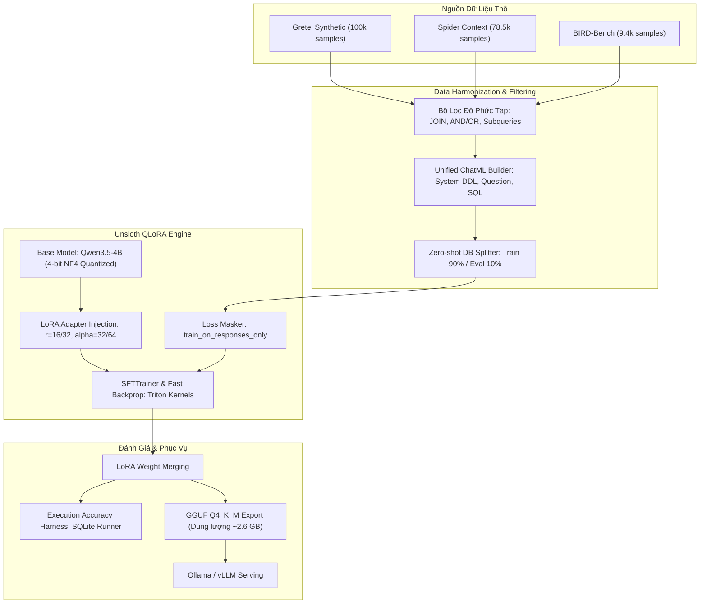

# Kiến Trúc Hệ Thống: Text-to-SQL Distillation & QLoRA Pipeline

Tài liệu này mô tả chi tiết toàn bộ kiến trúc kỹ thuật của hệ thống Text-to-SQL: từ giai đoạn tiếp nhận dữ liệu đa nguồn, xử lý tokenization, cơ chế attention trong Transformer, kỹ thuật QLoRA 4-bit của Unsloth cho đến quy trình hợp nhất và triển khai serving qua Ollama.

---

## 1. Sơ Đồ Kiến Trúc Tổng Thể (End-to-End Pipeline)



---

## 2. Phân Tích Lựa Chọn Mô Hình Nền Tảng: Qwen3.5-4B (4-bit NF4)

Trong bài toán Text-to-SQL phức tạp (nhiều bảng JOIN, điều kiện lồng nhau), việc chọn mô hình nền quyết định phần lớn năng lực giải quyết bài toán. Chúng ta chính thức lựa chọn **`Qwen/Qwen3.5-4B` (Bản 4-bit NF4)** làm mô hình nền tảng với các lý do kỹ thuật sau:

| Tiêu Chí | Llama-3.2 (3B) | Gemma-2 (2B) | Qwen2.5-Coder (3B) | **Qwen3.5-4B (Bản 4-bit NF4)** |
| :--- | :--- | :--- | :--- | :--- |
| **Kích thước tham số** | 3.21B | 2.61B | 3.09B | **~4.0B (Sweet Spot - Điểm ngọt hoàn hảo)** |
| **Dung lượng VRAM Base (4-bit)**| ~2.2 GB | ~2.0 GB | ~2.4 GB | **~3.1 GB (Cực kỳ nhẹ, GPU 8GB cân tốt)** |
| **Khả năng Native Reasoning** | Không (cần prompt ép) | Không | Không | **CÓ SẴN (`<think> ... </think>` native tags)** |
| **Pretrain Data trên Code/SQL** | Tổng quát | Tổng quát | Chuyên code 5.5T | **Kiến trúc thế hệ mới, suy luận logic vượt trội** |
| **Context Window & GQA** | 128k (GQA) | 8k | 32k (GQA) | **32k - 128k (GQA tối ưu KV Cache)** |
| **Tương thích Unsloth** | Rất tốt | Tốt | Rất tốt | **Được Unsloth hỗ trợ chính thức (Fast Kernels)** |

### Tại sao 4B (4-bit) lại là sự lựa chọn tối ưu nhất?
1. **Khả năng suy luận đa tầng (Multi-hop Reasoning)**: Các model 1.5B hoặc 3B thường dễ "bị loạn" khi phải phân tích mối quan hệ khóa ngoại giữa 4-5 bảng lồng nhau. Kích thước 4B bổ sung dung lượng tham số quan trọng giúp mô hình nắm vững cấu trúc schema phức tạp của BIRD-bench.
2. **VRAM siêu tiết kiệm với 4-bit NormalFloat (NF4)**:
   - Base model 4B khi nạp 4-bit chỉ chiếm **~3.1 GB VRAM**.
   - Cộng thêm bộ nhớ kích hoạt (Activations) khi context dài 2048 tokens và LoRA adapter, tổng VRAM tiêu thụ trong suốt quá trình train chỉ rơi vào khoảng **~5.8 - 6.5 GB VRAM**.
   - Điều này đảm bảo bạn có thể huấn luyện hoàn toàn ổn định trên các GPU tiêu dùng phổ biến như **RTX 3060 (Laptop/Desktop), RTX 4060 (8GB)** hoặc Google Colab T4 miễn phí mà không bao giờ gặp lỗi OOM (Out Of Memory).
3. **Phù hợp hoàn hảo với trường phái DeepSeek-R1**: Qwen3.5 có sẵn template hỗ trợ thẻ `<think>`, giúp chắt lọc chuỗi suy luận giải thích trước khi sinh ra câu SQL cuối cùng.

---

## 3. Cơ Chế Transformer & Tối Ưu Hóa Bộ Nhớ trong Text-to-SQL

### 3.1. Thách thức về Context Window
Text-to-SQL có đặc trưng là phần **Prompt (Input) rất dài**:
* Database Schema của Spider hoặc BIRD có thể gồm 5-15 bảng, mỗi bảng 10 cột -> tổng cộng 1.000 - 3.000 tokens.
* Nhưng phần **Completion (Output)** lại tương đối ngắn: 50 - 200 tokens (câu lệnh SQL).

Nếu không tối ưu, độ phức tạp tính toán của Self-Attention O(N^2) sẽ làm cạn kiệt bộ nhớ GPU rất nhanh.

### 3.2. Grouped-Query Attention (GQA) & RoPE Scaling
* **GQA (Grouped-Query Attention)**: Thay vì mỗi Query Head có riêng 1 Key Head và 1 Value Head, GQA nhóm nhiều Query Heads dùng chung một cặp Key-Value. Nhờ đó, kích thước **KV Cache** giảm từ 4 đến 8 lần, cho phép mở rộng context mà không lo tràn VRAM.
* **RoPE (Rotary Position Embedding)**: Mã hóa vị trí tương đối giữa các token thay vì vị trí tuyệt đối. Điều này giúp model dễ dàng liên kết tên cột trong mệnh đề WHERE với định nghĩa của cột đó trong câu lệnh CREATE TABLE nằm ở đầu prompt.

---

## 4. Kiến Trúc QLoRA (Quantized Low-Rank Adaptation)

Thay vì cập nhật toàn bộ hàng tỷ tham số của mô hình (Full Fine-tuning), QLoRA đóng băng (freeze) trọng số gốc ở dạng 4-bit NormalFloat (NF4) và chèn các ma trận phân rã hạng thấp (Low-Rank Matrices A và B) vào các lớp Linear.

\Delta W = B \cdot A, \quad \text{với } B \in \mathbb{R}^{d \times r}, A \in \mathbb{R}^{r \times k}, \quad r \ll \min(d, k)

### Các lớp được tiêm LoRA (Target Modules):
Trong Unsloth, toàn bộ các khối biến đổi tuyến tính trong Attention và MLP đều được gắn adapter để tối đa hóa khả năng học cú pháp SQL:
* **Attention Blocks**: q_proj, k_proj, _proj, o_proj
* **MLP Blocks**: gate_proj, up_proj, down_proj

---

## 5. Định Dạng Luồng Dữ Liệu Chuẩn (Qwen3.5 ChatML + Reasoning Specification)

Để tương thích hoàn hảo với tokenizer của **Qwen3.5-4B** và template của Unsloth, luồng token được định dạng theo cấu trúc ChatML thế hệ mới có tích hợp thẻ suy luận:

```text
<|im_start|>system
Bạn là chuyên gia cơ sở dữ liệu SQLite. Hãy phân tích cấu trúc Database Schema và viết câu lệnh SQL chính xác để trả lời câu hỏi của người dùng.

### DATABASE SCHEMA:
CREATE TABLE customers (customer_id INTEGER PRIMARY KEY, customer_name TEXT, segment TEXT);
CREATE TABLE orders (order_id INTEGER PRIMARY KEY, customer_id INTEGER, order_amount REAL, order_date DATE, FOREIGN KEY (customer_id) REFERENCES customers(customer_id));
<|im_end|>
<|im_start|>user
Tìm khách hàng phân khúc 'Enterprise' có tổng chi tiêu cao nhất năm 2024?
<|im_end|>
<|im_start|>assistant
<think>
1. Xác định bảng cần dùng: 'customers' (lấy customer_name, segment) và 'orders' (lấy order_amount, order_date).
2. Khóa liên kết: customers.customer_id = orders.customer_id.
3. Điều kiện lọc: segment = 'Enterprise' và strftime('%Y', order_date) = '2024'.
4. Tính toán: SUM(order_amount) đặt tên alias là total_spent, nhóm theo customer_id.
5. Sắp xếp giảm dần và lấy LIMIT 1.
</think>
SELECT c.customer_name, SUM(o.order_amount) AS total_spent
FROM customers c
JOIN orders o ON c.customer_id = o.customer_id
WHERE c.segment = 'Enterprise' AND strftime('%Y', o.order_date) = '2024'
GROUP BY c.customer_id, c.customer_name
ORDER BY total_spent DESC
LIMIT 1;
<|im_end|>
```

---

## 6. Vòng Đời Triển Khai (Serving Lifecycle)

Sau khi quá trình huấn luyện hoàn tất:
1. **Hợp nhất trọng số (Merge LoRA)**: Trọng số adapter được cộng trực tiếp vào mô hình gốc để tạo thành mô hình Standalone 16-bit.
2. **Chuyển đổi GGUF & Lượng tử hóa**:
   - Sử dụng công cụ `llama.cpp` tích hợp trong Unsloth để xuất ra file `.gguf`.
   - Lựa chọn định dạng `q4_k_m` (dung lượng khoảng **~2.6 GB** cho bản 4B, tốc độ suy luận > 50 tokens/s trên CPU và > 150 tokens/s trên GPU).
3. **Triển khai Offline**: Nạp trực tiếp vào Ollama hoặc vLLM để tích hợp vào Backend API qua cổng OpenAI-compatible endpoint.
