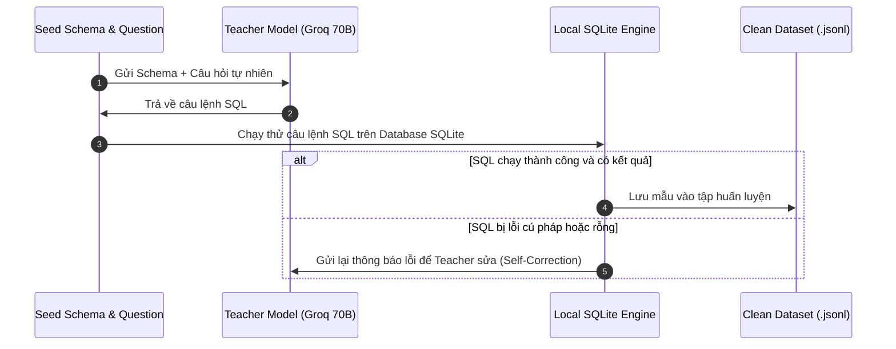

# Cẩm Nang Toàn Diện Về Distillation Trong Kỷ Nguyên LLM

Tài liệu này giải thích bản chất của **Knowledge Distillation (Chưng cất tri thức)**, cách áp dụng vào bài toán Text-to-SQL phức tạp, kỹ thuật Reasoning Distillation (phong cách DeepSeek-R1) và hướng dẫn tự xây dựng pipeline chắt lọc tri thức hoàn toàn miễn phí.

---

## 1. Bản Chất Của Distillation Trong Kỷ Nguyên LLM

Chưng cất tri thức (Knowledge Distillation - KD) là kỹ thuật chuyển giao tri thức, khả năng suy luận và sự nhạy bén từ một **Mô hình Thầy (Teacher Model)** có kích thước khổng lồ (70B - 405B tham số) sang một **Mô hình Trò (Student Model)** nhỏ gọn (1.5B - 3B tham số).

Trong kỷ nguyên LLM hiện đại, có 2 trường phái chắt lọc:

```text
+------------------------------------------------------------------------+
|                        KNOWLEDGE DISTILLATION                          |
+-----------------------------------+------------------------------------+
| 1. Logits-based KD (White-box)    | 2. Sequence / Synthetic KD (Black) |
+-----------------------------------+------------------------------------+
| * So sánh phân phối xác suất      | * Teacher sinh ra câu trả lời      |
|   (Logits / Softmax) của Teacher  |   hoàn chỉnh (hoặc kèm suy luận).  |
|   và Student qua KL-Divergence.   |                                    |
| * Yêu cầu truy cập trực tiếp      | * Chỉ cần Teacher sinh text        |
|   vào trọng số bên trong.         |   (Black-box API hoặc Open Model). |
| * Bắt buộc Tokenizer 2 bên giống  | * Không phụ thuộc Tokenizer.       |
|   hoặc phải map vocabulary.       |                                    |
| * Rất tốn kém về tính toán.       | * Đây là chuẩn mực của ngành AI!   |
+-----------------------------------+------------------------------------+
```

> **Kết luận**: Đối với dự án này, chúng ta sử dụng **Sequence-level Synthetic Distillation** — kỹ thuật mà chính DeepSeek-R1, Microsoft Orca, và Llama-3-Instruct áp dụng để huấn luyện các bản distilled models.

---

## 2. DeepSeek-R1 Style: Reasoning Distillation Trong Text-to-SQL

### 2.1. Tại sao Student Model thường viết sai SQL phức tạp?
Khi đối mặt với yêu cầu: *"Tìm khách hàng mua nhiều nhất nhưng chưa từng trả hàng"*, các model 1B-3B thông thường hay nhảy thẳng vào viết cú pháp `SELECT ... FROM ... JOIN ...` mà **không hề có bước lập kế hoạch**. Kết quả là:
- Chọn sai bảng để JOIN.
- Quên điều kiện lọc `WHERE return_id IS NULL`.
- Cú pháp hàm ngày tháng bị sai trên SQLite.

### 2.2. Cơ Chế Chắt Lọc Chuỗi Tư Duy (Chain-of-Thought Distillation)
Trong tập dữ liệu **Gretel Synthetic** mà chúng ta đã tải, có cột `sql_explanation`. Đây chính là chuỗi tư duy được chắt lọc từ GPT-4:

```text
[Teacher Input]:
Database Schema + Câu hỏi của người dùng.

[Teacher Output (Chain-of-Thought)]:
1. Xác định bảng mục tiêu: Bảng 'customers', 'orders', 'order_returns'.
2. Khóa liên kết: customers.id = orders.customer_id.
3. Logic loại trừ: Dùng LEFT JOIN với 'order_returns' và kiểm tra 'order_returns.id IS NULL'.
4. Tổng hợp: SUM(orders.total_amount), nhóm theo customer_id.
5. Cú pháp SQL cuối cùng.
```

Khi Student Model được huấn luyện trên dữ liệu này, nó không chỉ học thuộc lòng cú pháp SQL mà còn học được **phương pháp suy luận từng bước (Mental Steps)** trước khi chốt câu lệnh.

---

## 3. Bản Đồ 3 Nguồn Dữ Liệu Chắt Lọc Của Chúng Ta

Dự án này sử dụng 3 tập dữ liệu chắt lọc đỉnh cao trên thế giới:

1. **Gretel Synthetic (`gretelai/synthetic_text_to_sql`)**:
   - Được đội ngũ Gretel AI tạo ra bằng cách prompt GPT-4 với các kịch bản database đa ngành nghề.
   - Chứa hơn 29.500 mẫu nâng cao có giải thích chi tiết (`sql_explanation`).
2. **Spider Context (`b-mc2/sql-create-context`)**:
   - Chắt lọc từ hàng trăm schema học thuật của Đại học Yale.
   - Tập trung vào các liên kết khóa ngoại (Foreign Keys) nhiều tầng.
3. **BIRD-Bench (`xu3kev/BIRD-SQL-data-train`)**:
   - Đỉnh cao thực tế với cột `evidence` (bằng chứng / tri thức miền): Dạy model cách dịch từ ngữ đời thường thành điều kiện lọc cụ thể (ví dụ: *"khách hàng VIP"* tương ứng với `spending > 10000`).

---

## 4. Hướng Dẫn Tự Distill Dữ Liệu Mới Miễn Phí 100%

Nếu bạn muốn mở rộng dataset với các schema database riêng của bạn mà không tốn tiền API:

### 4.1. Sử dụng Groq Cloud (Tốc độ > 300 tokens/s, Miễn phí)
Groq cung cấp miễn phí API cho các model mã nguồn mở mạnh nhất:
- `llama-3.3-70b-versatile`
- `qwen-2.5-coder-32b`

### 4.2. Kỹ Thuật Self-Correction Loop (Lọc Tự Động Bằng SQLite)
Quy trình tự động sinh dữ liệu chất lượng cao:



Nhờ có vòng lặp kiểm thử bằng SQLite Engine thật, **mọi mẫu dữ liệu đưa vào tập train đều đảm bảo đúng cú pháp 100%**, loại bỏ hoàn toàn hiện tượng ảo giác (hallucination) của mô hình Teacher.
