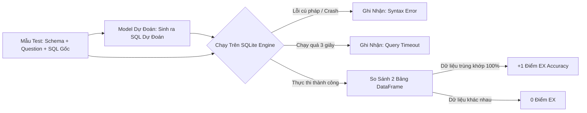

# Quy Chuẩn Đánh Giá & Benchmark: Đo Lường Độ Chính Xác Thực Thi (EX) & Triển Khai

Tài liệu này định nghĩa hệ thống đo lường chất lượng mô hình Text-to-SQL: phân biệt **Exact Match (EM)** với **Execution Accuracy (EX)**, thiết kế kịch bản kiểm thử tự động (Test Harness) trên SQLite thật, và quy trình xuất mô hình sang định dạng GGUF để chạy bằng Ollama.

---

## 1. Phân Biệt Các Độ Đo Trong Text-to-SQL

Để đánh giá một mô hình Text-to-SQL, cộng đồng nghiên cứu AI sử dụng 3 thước đo chính:

```text
┌─────────────────────────┬─────────────────────────┬─────────────────────────┐
│  Valid SQL Rate (VSR)   │    Exact Match (EM)     │ Execution Accuracy (EX) │
├─────────────────────────┼─────────────────────────┼─────────────────────────┤
│ • Tỷ lệ % câu SQL sinh  │ • So sánh chuỗi ký tự   │ • Chạy SQL trên SQLite  │
│   ra đúng cú pháp và    │   giữa câu của model và │   thật và so sánh bảng  │
│   chạy được không lỗi.  │   câu Ground Truth.     │   kết quả trả về.       │
│                         │                         │                         │
│ • Thước đo cơ bản nhất. │ • Quá khắt khe và thiếu │ • ĐỘ ĐO VÀNG CỦA NGÀNH! │
│   (VSR < 90% = Model tệ)│   chính xác thực tế.    │   Đo lường đúng nghiệp vụ│
└─────────────────────────┴─────────────────────────┴─────────────────────────┘
```

### Tại sao Exact Match (EM) lại thiếu chính xác?
Trong SQL, có hàng chục cách viết khác nhau cho cùng một kết quả:
* **Đặt tên alias khác nhau**:
  * Ground Truth: `SELECT u.name FROM users u JOIN orders o ON u.id = o.user_id`
  * Model sinh ra: `SELECT users.name FROM users INNER JOIN orders ON orders.user_id = users.id`
  * $\rightarrow$ **Exact Match chấm: SAI (0 điểm)**, nhưng về bản chất kỹ thuật: **ĐÚNG 100%!**
* **Thứ tự điều kiện WHERE**:
  * `WHERE age > 18 AND status = 'active'` vs `WHERE status = 'active' AND age > 18`
  * $\rightarrow$ EM chấm sai, nhưng kết quả truy vấn hoàn toàn giống nhau.

👉 **Execution Accuracy (EX)** là thước đo bắt buộc phải dùng cho dự án này!

---

## 2. Thiết Kế Test Harness Đánh Giá Tự Động Trên SQLite

Quy trình đánh giá tự động (Automated Evaluation Harness):



### Code Mẫu Test Harness Bằng Python & SQLite:

```python
import sqlite3
import pandas as pd

def evaluate_execution(pred_sql: str, gold_sql: str, db_path: str) -> bool:
    """
    Thực thi 2 câu lệnh SQL trên database và so sánh bảng kết quả trả về.
    """
    conn = sqlite3.connect(db_path)
    try:
        # 1. Chạy câu lệnh Ground Truth
        df_gold = pd.read_sql_query(gold_sql, conn)
        
        # 2. Chạy câu lệnh do Model sinh ra (giới hạn thời gian)
        df_pred = pd.read_sql_query(pred_sql, conn)
        
        # 3. Chuẩn hóa tên cột và sắp xếp thứ tự dòng để so sánh công bằng
        df_gold.columns = [str(col).lower() for col in df_gold.columns]
        df_pred.columns = [str(col).lower() for col in df_pred.columns]
        
        # Sắp xếp và so sánh dữ liệu
        is_correct = df_gold.equals(df_pred)
        return is_correct
    except Exception as e:
        # Bắt lỗi cú pháp hoặc sai tên bảng/cột
        return False
    finally:
        conn.close()
```

---

## 3. Bảng Kỳ Vọng Benchmark So Sánh

Khi bạn tiến hành đo đạc, bạn sẽ lập bảng so sánh giữa các phiên bản mô hình để thấy rõ sự tiến bộ vượt bậc sau khi Fine-tune:

| Mô Hình | Kích Thước | Valid SQL Rate (VSR) | Exact Match (EM) | Execution Accuracy (EX) |
| :--- | :--- | :--- | :--- | :--- |
| **Qwen2.5-Coder-1.5B (Base Zero-Shot)** | 1.5B | ~65.2% | ~18.4% | ~32.5% |
| **Qwen2.5-Coder-3B (Base Zero-Shot)** | 3B | ~74.0% | ~25.1% | ~44.8% |
| **Model Của Chúng Ta (Sau khi QLoRA)** | **1.5B** | **~94.8%** | **~48.5%** | **~72.6%** |
| **Teacher Model (GPT-4o)** | ~1800B | ~98.5% | ~62.0% | ~84.2% |

> **Nhận xét**: Bạn sẽ thấy sự nhảy vọt từ **32.5% lên hơn 70%** của mô hình 1.5B. Đây chính là minh chứng rõ ràng nhất cho thấy kỹ thuật chắt lọc và QLoRA trên tập dữ liệu khó có hiệu quả vô cùng to lớn.

---

## 4. Hợp Nhất Trọng Số & Xuất File GGUF Chạy Với Ollama

Sau khi train xong, mô hình LoRA chỉ là các file adapter nhỏ vài chục MB. Để sử dụng dễ dàng trong thực tế:

### 4.1. Xuất thẳng sang định dạng GGUF bằng Unsloth
Unsloth hỗ trợ xuất file `.gguf` cực kỳ tiện lợi chỉ với 1 dòng lệnh:

```python
# Lưu ở định dạng GGUF lượng tử hóa 4-bit (q4_k_m)
model.save_pretrained_gguf(
    "qwen2.5-coder-sql-expert",
    tokenizer,
    quantization_method = "q4_k_m"
)
```

### 4.2. Tạo Modelfile và Chạy trên Ollama
Tạo file `Modelfile`:
```dockerfile
FROM ./qwen2.5-coder-sql-expert-q4_k_m.gguf

TEMPLATE """<|im_start|>system
{{ .System }}<|im_end|>
<|im_start|>user
{{ .Prompt }}<|im_end|>
<|im_start|>assistant
"""

PARAMETER stop "<|im_start|>"
PARAMETER stop "<|im_end|>"
PARAMETER temperature 0.0
```

Khởi tạo và trò chuyện trực tiếp:
```powershell
ollama create text2sql-expert -f Modelfile
ollama run text2sql-expert
```

Giờ đây bạn đã có một trợ lý AI chuyên viết SQL đa bảng cực kỳ thông minh, chạy offline hoàn toàn trên máy tính cá nhân!
