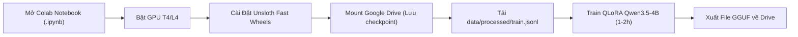
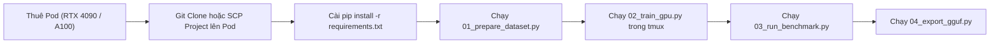

# Cấu Trúc Dự Án & Hướng Dẫn Luồng Thực Thi Đa Môi Trường (Colab vs GPU Server)

Tài liệu này định nghĩa chi tiết cấu trúc phân cấp thư mục của dự án, sự tách biệt giữa tập dữ liệu Huấn luyện (Train) và Đánh giá (Benchmark), cùng hướng dẫn quy trình chạy trên 2 môi trường phổ biến: **Google Colab (T4/L4/A100)** và **Dedicated GPU Server (RunPod / Vast.ai)**.

---

## 1. Sơ Đồ Cây Thư Mục Chi Tiết

```text
D:/FinetuneV1/
├── README.md                           # Trang chủ dự án, tóm tắt và hướng dẫn bắt đầu nhanh
├── requirements.txt                    # Danh sách thư viện Python cho môi trường GPU Server
├── download_data.py                    # Script tải 3 tập dữ liệu thô ban đầu
│
├── configs/                            # Thư mục chứa cấu hình tập trung
│   └── training_config.yaml            # Cấu hình siêu tham số (LR, Batch size, LoRA Rank, Context length)
│
├── data/                               # Dữ liệu phục vụ huấn luyện và kiểm thử
│   ├── processed/                      # Dữ liệu sạch sau khi lọc & gộp từ 3 nguồn
│   │   ├── train.jsonl                 # Tập huấn luyện (~18.000 câu phức tạp, có JOIN >= 2 bảng)
│   │   └── val.jsonl                   # Tập kiểm định trong quá trình train (~1.000 câu)
│   └── benchmark/                      # TẬP DỮ LIỆU BENCHMARK ĐỘC LẬP
│       ├── test_benchmark.jsonl        # Bộ câu hỏi kiểm thử thuộc các Database chưa từng gặp (Zero-shot)
│       └── sqlite_dbs/                 # Các file SQLite thật phục vụ đo Execution Accuracy (EX)
│           ├── spider_eval.sqlite
│           └── bird_eval.sqlite
│
├── notebooks/                          # Dành riêng cho môi trường Google Colab
│   └── text2sql_qwen3_5_4b_colab.ipynb # Notebook 1-Click: Cài Unsloth, Mount Drive, Train & Export GGUF
│
├── src/                                # Mã nguồn module hóa (dùng chung cho mọi môi trường)
│   ├── __init__.py
│   ├── data_processor.py               # Module lọc câu khó, format ChatML, phân tách Database ID
│   ├── trainer.py                      # Module khởi tạo Qwen3.5-4B 4-bit, cấu hình LoRA & Loss Masking
│   └── evaluator.py                    # Module Test Harness: thực thi SQL trên SQLite và so khớp DataFrame
│
├── scripts/                            # Các script chạy độc lập bằng dòng lệnh (Dành cho GPU Server)
│   ├── 01_prepare_dataset.py           # Tiền xử lý dữ liệu thô ra data/processed/ và data/benchmark/
│   ├── 02_train_gpu.py                 # Huấn luyện trên GPU Server (có checkpoint, ghi log Weights & Biases)
│   ├── 03_run_benchmark.py             # Chạy kiểm thử tự động đo Valid SQL Rate (VSR), EM và EX
│   └── 04_export_gguf.py               # Hợp nhất LoRA weights và xuất định dạng GGUF (Q4_K_M) cho Ollama
│
├── docs/                               # Toàn bộ hệ thống tài liệu kỹ thuật
│   ├── architecture.md                 # Kiến trúc hệ thống & Lựa chọn Qwen3.5-4B (4-bit NF4)
│   ├── distillation_guide.md           # Lý thuyết chắt lọc tri thức & Reasoning Distillation
│   ├── data_pipeline.md                # Quy chuẩn lọc dữ liệu & Chiến lược chống rò rỉ (Zero-shot DB)
│   ├── finetuning_unsloth.md           # Kỹ thuật Unsloth, QLoRA và Loss Masking (train_on_responses_only)
│   ├── evaluation_benchmark.md         # Quy chuẩn đo Execution Accuracy (EX) trên SQLite
│   └── project_structure_and_workflows.md # Tài liệu hướng dẫn cấu trúc và workflow (file này)
│
├── raw_data/                           # Dữ liệu gốc tải về từ Hugging Face
│   ├── gretel/                         # 100.000 mẫu
│   ├── spider_context/                 # 78.577 mẫu
│   └── bird_bench/                     # 9.428 mẫu
│
└── .venv/                              # Môi trường ảo Python cục bộ (trên máy Windows cá nhân)
```

---

## 2. Phân Tách Dữ Liệu: Train vs. Benchmark

Nhằm đảm bảo mô hình có khả năng tổng quát hóa thực sự, dữ liệu được chia làm 2 phân vùng hoàn toàn tách biệt:

### 2.1. Phân vùng Huấn luyện (`data/processed/`)
* **`train.jsonl`** (~18.000 mẫu):
  * Lọc nghiêm ngặt từ 3 nguồn: bắt buộc phải có `JOIN` giữa các bảng, hoặc từ 2 điều kiện `AND`/`OR` trở lên, hoặc có Subquery/Window Function.
  * Được định dạng theo chuẩn **ChatML với thẻ `<think>`** của Qwen3.5.
* **`val.jsonl`** (~1.000 mẫu):
  * Dùng để theo dõi hàm mất mát (Validation Loss) sau mỗi chu kỳ (epoch) nhằm phát hiện sớm hiện tượng Overfitting.

### 2.2. Phân vùng Benchmark Độc Lập (`data/benchmark/`)
* **`test_benchmark.jsonl`** (~1.000 mẫu):
  * **Tuyệt đối không chứa bất kỳ Database nào có mặt trong tập train** (Zero-shot Database Split).
* **`sqlite_dbs/`**:
  * Chứa các file cơ sở dữ liệu SQLite thật.
  * Khi đánh giá, script `03_run_benchmark.py` sẽ nạp database này vào bộ nhớ, chạy câu lệnh do model sinh ra và so sánh dữ liệu bảng kết quả với câu SQL chuẩn để tính điểm **Execution Accuracy (EX)**.

---

## 3. Luồng Triển Khai Trên Google Colab (Miễn Phí T4 / Pro L4)

Google Colab là môi trường lý tưởng để thử nghiệm nhanh mà không tốn chi phí thuê phần cứng.



### Các bước vận hành trên Colab:
1. Mở file [notebooks/text2sql_qwen3_5_4b_colab.ipynb](notebooks/text2sql_qwen3_5_4b_colab.ipynb) trên Google Colab.
2. Chọn Runtime: `Runtime -> Change runtime type -> T4 GPU` (hoặc L4/A100 nếu có Colab Pro).
3. **Mount Google Drive**: Để mô hình sau khi train hoặc checkpoint được tự động lưu vào Google Drive, tránh mất dữ liệu khi bị timeout:
   ```python
   from google.colab import drive
   drive.mount('/content/drive')
   ```
4. Chạy toàn bộ các cell tuần tự: cài đặt Unsloth $\rightarrow$ nạp Qwen3.5-4B 4-bit $\rightarrow$ nạp `train.jsonl` $\rightarrow$ bắt đầu train $\rightarrow$ xuất file `.gguf` lưu thẳng vào Google Drive.

---

## 4. Luồng Triển Khai Trên Server GPU Thuê (RunPod / Vast.ai / Lambda Labs)

Môi trường Server GPU phù hợp khi bạn cần train tốc độ cao trên GPU mạnh (RTX 4090, A6000, A100) hoặc muốn chạy tự động trong nền (headless).



### Lợi ích khi train bằng Script trên Server:
* **Chạy nền bằng `tmux` hoặc `nohup`**: Bạn có thể tắt máy tính cá nhân đi ngủ trong khi Server GPU tiếp tục huấn luyện xuyên đêm.
* **Ghi log chuyên nghiệp với Wandb**: Dễ dàng theo dõi biểu đồ Learning Rate, Loss, GPU VRAM theo thời gian thực từ điện thoại hoặc trình duyệt web.
* **Lưu Checkpoints tự động**: Lưu trạng thái sau mỗi 200 steps, nếu server bị ngắt đột ngột có thể tiếp tục train ngay từ checkpoint gần nhất (`--resume_from_checkpoint`).

---

## 5. Tóm Tắt Vai Trò Các File Trong `scripts/`

| File Script | Mục Đích Sử Dụng | Môi Trường |
| :--- | :--- | :--- |
| **`01_prepare_dataset.py`** | Đọc dữ liệu từ `raw_data/`, lọc bỏ basic SQL, tạo ra `data/processed/train.jsonl` và `data/benchmark/test_benchmark.jsonl`. | Chạy 1 lần trên máy cá nhân hoặc server |
| **`02_train_gpu.py`** | Đọc cấu hình từ `configs/training_config.yaml`, khởi chạy Unsloth QLoRA trên GPU, lưu adapter vào thư mục `outputs/`. | Chạy trên GPU Server / RunPod |
| **`03_run_benchmark.py`** | Nạp model sau khi train, chạy kiểm thử trên tập `data/benchmark/` và các SQLite database thật, tính toán chỉ số VSR, EM và EX. | Chạy sau khi train xong |
| **`04_export_gguf.py`** | Hợp nhất LoRA weights vào base model, chuyển đổi sang định dạng GGUF (`q4_k_m`) phục vụ Ollama. | Chạy sau khi benchmark đạt yêu cầu |
